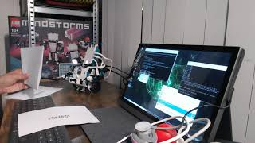

## Text recognition (OCR) demo with Charlie
In this demo, Charlie will read Chinese sentences from a piece of paper.
When the piece of paper is within a distance of 20 centimeters, Charlie will
try to read the sentence. If the text is recognized, Charlie will repeat it in Chinese.
After that, Charlie will translate the text to English and display it on the LED matrix.
Finally, Charlie will speak out the English translation.

### Demo video
[](https://youtu.be/AtLgXSPTPT8)

### Extra required hardware
A few accessory hardware items are required for running the demo.

#### HDMI monitor
You need an HDMI monitor for starting up the demo from the desktop.

#### Bluetooth keyboard and mouse
A Bluetooth keyboard and mouse are recommended for ease-of-use.
This way, only plugging in the HDMI cable is needed for programming the robot.
Besides, the Jetson Nano 2GB only has three USB ports, which will be needed
by the following peripheral devices.

#### Wi-fi dongle
If not already provided, you need to get a Wi-fi dongle for remote ssh access or 
access to the Google Speech API's.

#### Bluetooth dongle
For connectivity with the LEGO Hub, you need a BLE (Bluetooth Low Energy) dongle.
This dongle is also used for the Bluetooth speaker, keyboard and mouse.
For this demo, a CSR 4.0 dongle was used. A Bluegiga dongle was not working on the Jetson Nano.

#### Camera
For this demo, the [IMX219-77](https://www.waveshare.com/imx219-77-camera.htm) Camera with 77° FOV was used.

#### Power bank
For standalone operation, the Jetson Nano needs a power bank or battery pack.
The Lego Hub itself is using a rechargeable lithium-ion battery.
A power bank should have output 5V and 2,4A. 1,0A will still work.

#### Bluetooth speaker
For this demo, a mini Bluetooth speaker was used.
 
## Software installation
Now it's time to do some sudo and pip commands (and some kernel recompilation...):
```
sudo apt-get update
sudo apt-get install python3-pip
```

### Serial communication
As mentioned above, the default kernel on the Jetson Nano needs to be recompiled in order to enable
serial communication. This is quite a heavy process and will take about one hour.
[This page](https://blog.hypriot.com/post/nvidia-jetson-nano-build-kernel-docker-optimized/) gives
a good description of the kernel recompilation process. Before starting, be sure to have 9 GB space available.
When configuring the new kernel, enable the following features:
  * serial (tty) communication
  * Bluetooth LE

Furthermore, the following commands are required for serial communication.
```
sudo apt-get install rfcomm
sudo pip3 install pyserial
```
### OpenCV
The Jetson Nano 2GB is provided with a pre-installed software package (JetPack 4.4).
One of the many AI libraries is [OpenCV](https://opencv.org/). 
In this demo, OpenCV is only used for capturing and enhancing video frames. 

### Text recognition (OCR)
For text recognition, [Tesseract OCR 4.0.0](https://tesseract-ocr.github.io/) is used
```
sudo apt install tesseract-ocr
sudo pip3 install pytesseract
sudo apt install tesseract-ocr-chi-sim
```
Fix a small issue with the trained data:
``` 
/usr/share/tesseract-ocr/4.00/tessdata$ sudo mv chi_sim.traineddata chi-sim.traineddata
```

#### Google Translate
```
sudo pip3 install googletrans
```

### Text-to-speech
For this demo, the Google Cloud Speech API has been used:
* [Text-to-Speech](https://cloud.google.com/text-to-speech)

The Python library [gTTS](https://pypi.org/project/gTTS/) is used.
In order to play the sound on the Bluetooth speaker, follow the 
[Connecting Bluetooth Audio tutorial](https://developer.nvidia.com/embedded/learn/tutorials/connecting-bluetooth-audio).

```
sudo pip3 install gTTs
sudo apt-get install mpg123
sudo apt-get install flac
sudo apt-get install pulseaudio-module-bluetooth
```

Finally:
```
sudo reboot
```

## Usage
1. Connect the HDMI cable with the Jetson Nano
1. In the desktop, start the Bluetooth manager
1. Connect with the LEGO Hub
  1. Get permission for the serial connection: ```sudo chmod  777 /dev/rfcomm0```
  (or do: ```sudo usermod -a -G dialout $USER```)
1. Open a terminal
1. Run the program with ```sudo python3 ocr_demo.py```
1. For standalone operation, disconnect the HDMI cable
1. Enjoy the show!

Stop the program by:
1. Connecting the HDMI cable again
2. Enter Ctrl+C in the terminal
