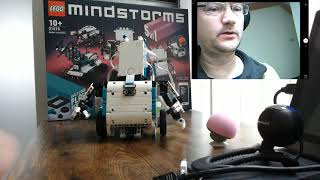

## Face recognition demo with Charlie
In this demo, Charlie will initially be trained with two face-images.
Any newly recognized face will be added to the list of known faces, by using the face encoding.
Charlie will ask for the name and record the name with a microphone.
When Charlie recognizes a face, it will greet and say the corresponding name.
Charlie will remember that name and not repeat it again.

### Demo video
[](https://youtu.be/Hq7MF1oaWUA)

### Extra required hardware
A few accessory hardware items are required for running the demo.

#### Microphone + adapter
For speech input, you can use a mini microphone with 3,5 mm jack in combination with
a USB adapter.

## Software installation
Now it's time to do some sudo and pip commands (and some kernel recompilation...):
```
sudo apt-get update
sudo apt-get install python3-pip
```

### Serial communication
As mentioned above, the default kernel on the Jetson Nano needs to be recompiled in order to enable
serial communication. This is quite a heavy process and will take about one hour.
[This page](https://blog.hypriot.com/post/nvidia-jetson-nano-build-kernel-docker-optimized/) gives
a good description of the kernel recompilation process. Before starting, be sure to have 9 GB space available.
When configuring the new kernel, enable the following features:
  * serial (tty) communication
  * Bluetooth LE

Furthermore, the following commands are required for serial communication.
```
sudo apt-get install rfcomm
sudo pip3 install pyserial
```
### OpenCV
The Jetson Nano 2GB is provided with a pre-installed software package (JetPack 4.4).
One of the many AI libraries is [OpenCV](https://opencv.org/). 
In this demo, OpenCV is only used for capturing and enhancing video frames. 

### Text-to-speech
For this demo, the Google Cloud Speech API has been used:
* [Text-to-Speech](https://cloud.google.com/text-to-speech)

The Python library [gTTS](https://pypi.org/project/gTTS/) is used.
In order to play the sound on the Bluetooth speaker, follow the 
[Connecting Bluetooth Audio tutorial](https://developer.nvidia.com/embedded/learn/tutorials/connecting-bluetooth-audio).

```
sudo pip3 install gTTs
sudo apt-get install mpg123
sudo apt-get install flac
sudo apt-get install pulseaudio-module-bluetooth
```

Finally:
```
sudo reboot
```

## Usage
1. Connect the HDMI cable with the Jetson Nano
1. In the desktop, start the Bluetooth manager
1. Connect with the LEGO Hub
  1. Get permission for the serial connection: ```sudo chmod  777 /dev/rfcomm0```
  (or do: ```sudo usermod -a -G dialout $USER```)
1. Open a terminal
1. Run the program with ```sudo python3 demo.py```
1. For standalone operation, disconnect the HDMI cable
1. Enjoy the show!

Stop the program by:
1. Connecting the HDMI cable again
2. Enter Ctrl+C in the terminal
